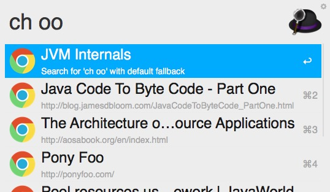

nodejs 版 alfred chrome 书签查看工具

### Install

[Download](https://github.com/Youmoo/alfred-chrome-bookmarks/raw/master/Chrome%20Bookmarks.alfredworkflow)

### Screen shot

### Changelog

#### 2017-07-25

1. 关键字`cht`: 搜索并打开给定tab